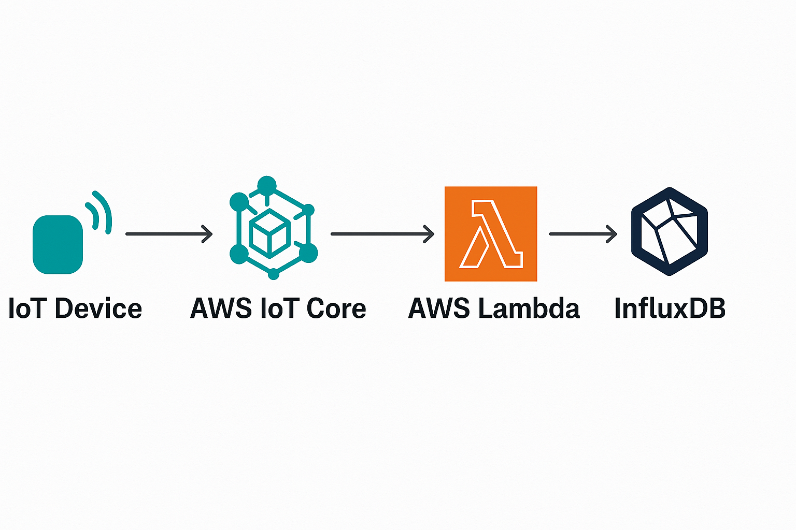

## Store data on S3 and show in grafana

 **Create Rule from IoT core to S3 Bucket**

Select data to store in S3
```
SELECT payload.temp as temp, payload.xaxis as xaxis, payload.yaxis as yaxis, payload.zaxis as zaxis FROM 'data'
```

Create folders and different locations of data to  storage on s3. These depends from the source of device

```
${device}/${timestamp()}.json

```

**Choose InfluxDB if:**


- You’re working with time series data (e.g., metrics, sensor data, IoT, logs).
- You need high write throughput and low-latency querying of time-stamped data.
- You want to run it yourself (self-hosted) or use InfluxDB Cloud.
- You need real-time monitoring and downsampling/retention policies.


**Choose Amazon Athena if:**
- Your data is in S3 (CSV, JSON, Parquet, ORC, etc.).
- You want to run ad hoc SQL queries without setting up a database.
- You’re okay with pay-per-query pricing (good for infrequent or analytical queries).
- You’re working with large, infrequently accessed datasets or log analytics.

**How use Influxdb to store data from iot core**

High-Level Architecture

IoT Device → AWS IoT Core → AWS Lambda (or Kinesis/IoT Rule) → InfluxDB



